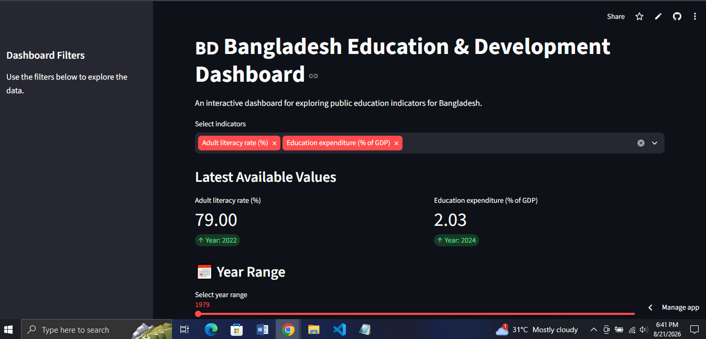

# 🇧🇩 Bangladesh Education & Development Dashboard

An interactive data dashboard for exploring education-related indicators of Bangladesh using Python, Pandas, Streamlit, and the World Bank Indicators API.


## 🚀 Live Demo

👉 https://bangladesh-education-development-dashboard.streamlit.app/


## 📸 Dashboard Preview




## 📌 Project Overview

This project presents an interactive dashboard for exploring selected education-related development indicators of Bangladesh.

Users can select indicators, explore historical trends, filter data by year, view the latest available values, generate basic data-driven insights, and download the underlying dataset as a CSV file.

The project was developed as a practical application of data analysis, API integration, data visualization, and interactive dashboard development.

## 🎯 Objectives

The main objectives of this project are to:

- Collect real-world development data through a public REST API
- Process and organize data using Python and Pandas
- Visualize historical education trends
- Build an interactive data dashboard
- Practice evidence-based data interpretation
- Make development-related data easier to explore and understand

## 📊 Key Features

- 🇧🇩 Bangladesh-focused education data
- 📈 Historical trend visualization
- 🔎 Automatic key insights
- 🎛️ Interactive indicator selection
- 📅 Year-range filtering
- 📊 Latest available indicator values
- 📋 Interactive dataset table
- 📥 CSV data download
- 🌐 Live data retrieval through the World Bank API

## 🛠️ Technologies Used

- Python
- Pandas
- Streamlit
- Requests
- REST API
- Data Visualization

## 🌐 Data Source

World Bank Indicators API

The dashboard uses publicly available World Bank development indicators for Bangladesh.

## 🔄 Data Workflow

```text
World Bank API
      ↓
Data Collection
      ↓
Data Processing with Pandas
      ↓
Data Filtering
      ↓
Visualization
      ↓
Interactive Streamlit Dashboard
      ↓
Key Insights & CSV Download

```

## ⚙️ Installation & Usage

```bash
git clone https://github.com/mdisrak21/bangladesh-education-development-dashboard.git
cd bangladesh-education-development-dashboard
pip install -r requirements.txt
streamlit run app.py
```

## 🔮 Future Improvements

- Add more updated datasets.
- Add geographic visualizations.
- Add downloadable analytical reports.
- Improve indicator comparison features.